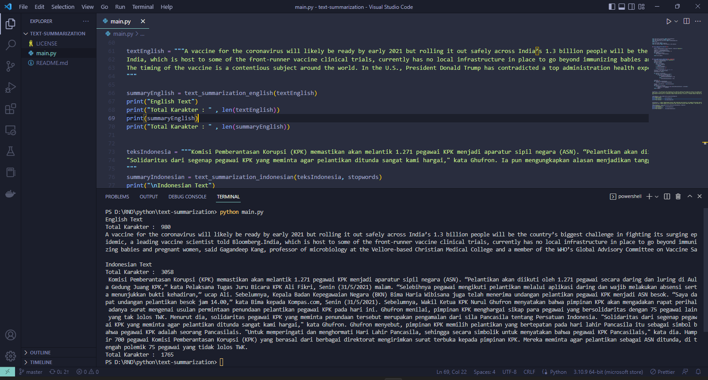

# Text Summarization Using Python & NLP

Natural Language Processing

### Deskripsi
Text Summarization adalah suatu cara untuk meringkas suatu dokumen ke dalam bentuk yang lebih sederhana dengan mengambil poin-poin penting dalam dokumen tersebut. Text Summarization menggunakan library Natural Language Toolkit (NLTK) berbasis pemrograman Python

### Output
  

## Contributing

Pull requests are welcome. For major changes, please open an issue first
to discuss what you would like to change.

Please make sure to update tests as appropriate.

## License

[MIT](https://choosealicense.com/licenses/mit/)